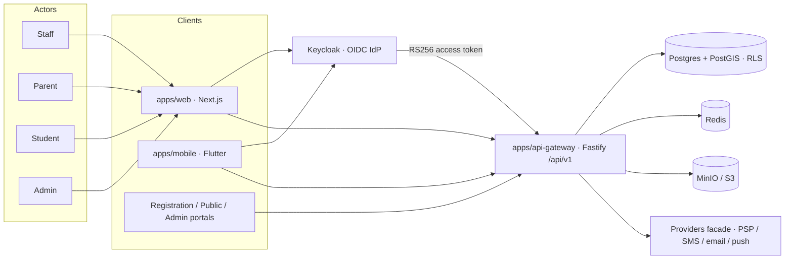

# ProctiraERP — High-level architecture

**IdP decision:** Keycloak is the platform identity provider ([ADR-001](./ADR-001-KEYCLOAK-IDP.md)).

## Context

## Containers

| Layer    | Component                       | Role                                                        |
| -------- | ------------------------------- | ----------------------------------------------------------- |
| Identity | **Keycloak**                    | Canonical IdP — realm `proctira`, client `proctira-gateway` |
| UI       | `apps/web` (+ portals, Flutter) | ERP & portal surfaces                                       |
| API      | `apps/api-gateway`              | JWT/JWKS verify, tenant, RBAC, mounts `packages/backend/*`  |
| Domains  | `packages/backend/*`            | In-process Fastify plugins (SIS, fees, LMS, admissions, …)  |
| Workers  | `apps/etl-worker`               | Pipelines / ETL                                             |
| Data     | Postgres, Redis, MinIO/S3       | System of record, cache, blobs                              |

**Runtime honesty:** Domains are mounted **in-process** in the gateway for local/dev. K8s charts may sketch split services as a future topology.

## Auth flow (deployed)

1. Browser hits `GET /api/auth/keycloak` (Next BFF) → gateway `/api/v1/auth/login`.
2. User authenticates at Keycloak; gateway `/api/v1/auth/callback` exchanges the code.
3. Subsequent API calls send `Authorization: Bearer <Keycloak access_token>`.
4. Gateway `keycloakAuthPlugin` validates via JWKS, maps realm roles → app roles, binds tenant.

**Fallback:** If `KEYCLOAK_ISSUER` / `KEYCLOAK_CLIENT_ID` are unset (CI/headless), the gateway uses local HS-JWT. That path is for automation only — **not** the product identity design.

## Domain plane

Gateway registrars under `/api/v1` cover student, institution, staff, attendance, examination, assessment, timetable, gradebook, curriculum, LMS, fees, registration/admissions, parent/student portals, health, transport, hostel, library, notifications, workflow, reports, ETL, plus platform plugins (auth, audit, billing, tenant, providers). See `docs/audits/GATEWAY_MOUNT_MATRIX.md`.

## Tenancy

Tenant → Board → Institution → classes / people. Enforced with JWT claims, `x-tenant-id`, and Postgres RLS (`app.tenant_id`). See `docs/architecture/BOARD_SCHOOL_TENANCY.md`.

## External providers

| Capability                    | Design                                          |
| ----------------------------- | ----------------------------------------------- |
| **Identity**                  | **Keycloak (required for product)**             |
| Payments / SMS / email / push | Providers facade; sandbox default until secrets |

## Local stack

`docker compose up` includes **Keycloak** importing `infra/keycloak/proctira-realm.json`. Set `KEYCLOAK_*` in `.env` (see `.env.example`) so the gateway and web use the IdP.

## Related docs

- [ADR-001 Keycloak IdP](./ADR-001-KEYCLOAK-IDP.md)
- `docs/PHASE_2_AUTH_SIGNOFF.md`
- `docs/runbooks/auth.md`
- `db/README.md`
